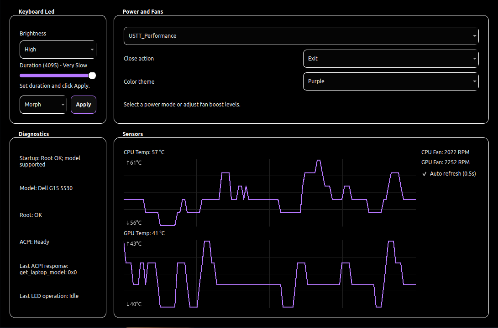

# Dell G15 5530 Controller



This is a Dell G15 5530-focused Linux controller app for:

- keyboard lighting (static, morph, off, brightness)
- power profile switching
- manual fan boost control

This fork intentionally targets the Dell G15 5530 only.

## What Is Different From Upstream

- device support narrowed to 5530 RGB controller (`187c:0551`)
- simplified UI focused on day-to-day use
- desktop launcher and tray integration
- brightness handling tuned to persist correctly after mode changes

## Credits

Original project by cemkaya-mpi:
https://github.com/cemkaya-mpi/Dell-G-Series-Controller

## Requirements

- Python 3
- kernel module: `acpi-call`
- Python packages:
  - `PySide6`
  - `pexpect`
  - `pyusb`

Install dependencies (example):

```bash
sudo modprobe acpi-call
python3 -m pip install --user PySide6 pexpect pyusb
```

## Compile and Run

From project folder:

```bash
python3 -m compileall -f .
```

This recreates all `__pycache__` files.

From project folder:

```bash
python3 main.py
```

You can also launch from the desktop entry:

- `dell-g-series-controller.desktop`
- launcher helper: `launch-dell-g-series-controller.sh`

## Optional: Passwordless Launch

If you want desktop launch without password prompts, install the included sudoers rule:

```bash
sudo install -m 440 ./dell-g-series-controller.sudoers /etc/sudoers.d/dell-g-series-controller
sudo visudo -cf /etc/sudoers.d/dell-g-series-controller
```

## Troubleshooting

### `No supported device was found. Expected RGB controller 187c:0551`

The RGB USB device is not visible to the app at that moment.

Try:

```bash
lsusb | grep -i 187c
```

If nothing appears:

- ensure you are running on a supported 5530 variant
- replug power / reboot and retry
- verify USB permissions and udev rule (`00-aw-elc.rules`)

### App asks for privileges / power controls missing

- load module: `sudo modprobe acpi-call`
- ensure `pkexec` is available or install sudoers rule above

## Project Files

- `main.py`: UI and runtime logic
- `awelc.py`: high-level LED control routines
- `elc.py`, `elc_constants.py`, `hidreport.py`: low-level USB/HID implementation
- `dell-g-series-controller.desktop`: apps-menu launcher metadata
- `launch-dell-g-series-controller.sh`: launcher with privilege fallback
