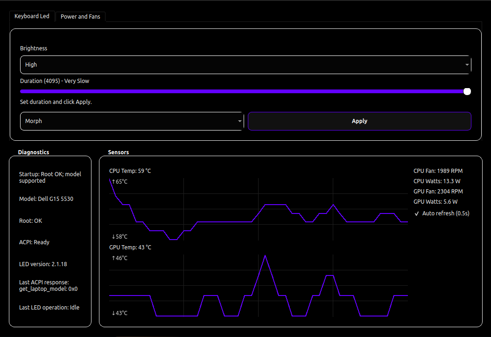
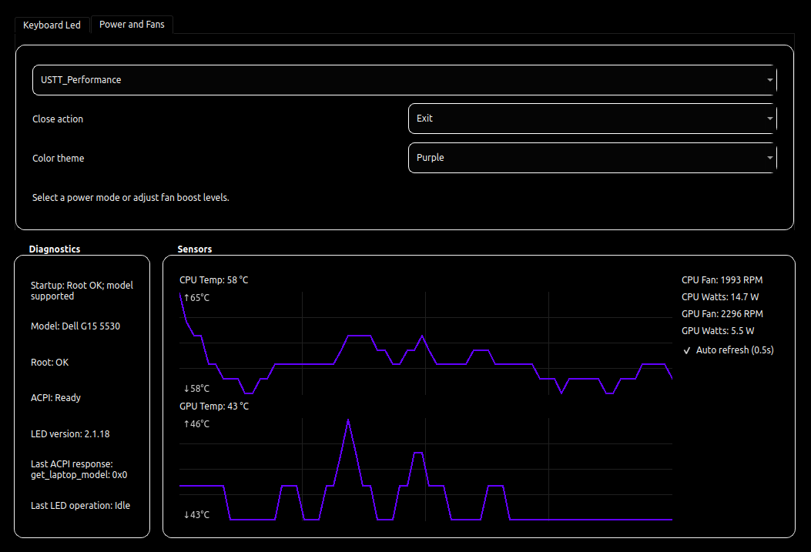

# Dell G15 5530 Controller

|         Keyboard Led         | Power and Fans               |
| :--------------------------: | ---------------------------- |
|  |  |

This is a **Dell G15 5530**-focused **Linux** controller app for:

- **Keyboard lighting** — static colour, morph animation, off, and brightness control
- **Power profile switching** — toggle between balanced, performance, and quiet modes
- **Manual fan boost** — force the fans to maximum speed when needed
- **System tray integration** — toggle LEDs with a single click from the tray icon
- **Diagnostics panel** — shows detected hardware, privilege state, and last applied settings

This fork intentionally targets the **Dell G15 5530** only.
(May add support to other Dell G and Alienware models if needed as the original git)

## What Is Different From Upstream

- device support narrowed to 5530 RGB controller (`187c:0551`)
- simplified UI focused on day-to-day use
- desktop launcher and tray integration
- brightness handling tuned to persist correctly after mode changes

## Credits

Original project by cemkaya-mpi:
https://github.com/cemkaya-mpi/Dell-G-Series-Controller

## Requirements

- Python 3
- kernel module: `acpi-call`
- Python packages:
  - `PySide6`
  - `pexpect`
  - `pyusb`
  - `pynvml` (optional, NVIDIA GPU power readings)

## Installation

### 1. Clone the repository

```bash
git clone https://github.com/PatrickMeerssche/Dell-5530-Controller.git
cd Dell-5530-Controller
```

### 2. Install the udev rule

The udev rule allows the app to access the RGB USB controller without root privileges:

```bash
sudo cp 00-aw-elc.rules /etc/udev/rules.d/
sudo udevadm control --reload-rules && sudo udevadm trigger
```

### 3. Install Python dependencies

```bash
python3 -m pip install --user PySide6 pexpect pyusb pynvml
```

### 4. Load the `acpi-call` kernel module

For the current session:

```bash
sudo modprobe acpi-call
```

To load it automatically at every boot, add it to the modules-load configuration:

```bash
echo "acpi-call" | sudo tee /etc/modules-load.d/acpi-call.conf
```

## Running the App

From the project folder:

```bash
python3 main.py
```

> **Note:** Pre-compiling to bytecode (`python3 -m compileall -f .`) is optional and only marginally speeds up startup. It is not required to run the app.

### Desktop launcher

To make the app appear in your application menu, install the `.desktop` entry:

```bash
cp Dell-5530-Controller.desktop ~/.local/share/applications/
```

The helper script `launch-Dell-5530-Controller.sh` handles privilege elevation automatically. Before using it, **edit the `APP_DIR` variable** at the top of the script to match your actual clone location (it defaults to `/home/$USER/Dell-5530-Controller`).

## Optional: Passwordless Launch

The udev rule installed in the [Installation](#installation) step already handles USB access without root. For full passwordless operation (including power profile and fan control via `acpi-call`), create a sudoers entry that allows running the app with `sudo -n`:

```bash
# Example: allow the current user to run the app without a password prompt
echo "$USER ALL=(ALL) NOPASSWD: /usr/bin/python3 $(pwd)/main.py" | sudo tee /etc/sudoers.d/Dell-5530-Controller
sudo visudo -cf /etc/sudoers.d/Dell-5530-Controller
```

Alternatively, ensure `pkexec` (polkit) is available — the launcher script will fall back to it automatically.

## Troubleshooting

### `No supported device was found. Expected RGB controller 187c:0551`

The RGB USB device is not visible to the app at that moment.

Try:

```bash
lsusb | grep -i 187c
```

If nothing appears:

- ensure you are running on a supported 5530 variant
- replug power / reboot and retry
- verify USB permissions and udev rule (`00-aw-elc.rules`) — see [Installation](#installation)

### App asks for privileges / power controls missing

- load module: `sudo modprobe acpi-call`
- ensure `pkexec` is available or set up the sudoers entry described above

## Project Files

```
Dell-5530-Controller/
├── main.py                             entry point — starts the Qt app and system tray
├── 00-aw-elc.rules                     udev rule for USB device access
├── Dell-5530-Controller.desktop    application menu launcher metadata
├── launch-Dell-5530-Controller.sh  launcher with privilege fallback
├── core/
│   ├── main_window.py                  main application window and UI orchestration
│   ├── services.py                     thin service wrappers (LED, ACPI, fans)
│   ├── tray.py                         system tray icon and click handling
│   └── constants.py                    shared UI constants and enums
├── hw/
│   ├── awelc.py                        high-level LED control routines
│   ├── elc.py                          low-level USB/HID communication
│   ├── elc_constants.py                HID report constants
│   └── hidreport.py                    HID report builder
└── ui/
    ├── led.py                          keyboard lighting panel
    ├── power.py                        power profile panel
    ├── sensors.py                      fan / temperature sensor panel
    └── diagnostics.py                  diagnostics info panel
```
